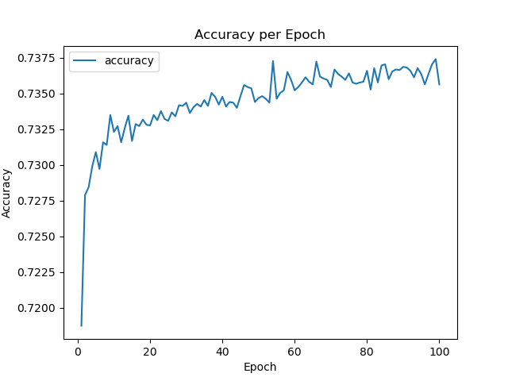

# deep-learning-challenge
Module Challenge 21 README

## Overview - of the analysis: Explain the purpose of this analysis.
The nonprofit foundation Alphabet Soup wants a tool that can help it select the applicants for funding with the best chance of success in their ventures. With your knowledge of machine learning and neural networks, you’ll use the features in the provided dataset to create a binary classifier that can predict whether applicants will be successful if funded by Alphabet Soup.

The data is a csv containing over 34000 organizations that have received funding from Alphabet Soup before.  The data includes columns:
    ['EIN', 'NAME', 'APPLICATION_TYPE', 'AFFILIATION', 'CLASSIFICATION', 'USE_CASE', 'ORGANIZATION', 'STATUS', 'INCOME_AMT', 'SPECIAL_CONSIDERATIONS', 'ASK_AMT', 'IS_SUCCESSFUL']

From these variables we will attempt to build, train and evaluate a model predicting successful campaigns.  

## Results
Using bulleted lists and images to support your answers, address the following questions:

### Data Preprocessing
* What variable(s) are the target(s) for your model?  **Targeted the variable column 'IS_SUCCESSFUL'**
* What variable(s) are the features for your model?  **The features are made up of the remaining variables that were not dropped**
* What variable(s) should be removed from the input data because they are neither targets nor features?  **Both 'EIN and 'NAME' were dropped from the dataset**

#### Compiling, Training, and Evaluating the Model
* How many neurons, layers, and activation functions did you select for your neural network model, and why?   **The hidden layers/neurons were: first:32, second:16, and third:8, with relu, relu, and tanh respectfully as the activations.  They were chosen pretty randomly to be honest** 
* Were you able to achieve the target model performance?  **I unfortunately was not able to reach 75% on my model, the highest I could achieve was about 73.75**

* What steps did you take in your attempts to increase model performance? **I tried increasing the number of layers and neurons as well as tried different activations all with little improvement in the model.**

## Summary
The model loss and accuracy against the test data can be seen below:  
```215/215 - 0s - loss: 0.5586 - accuracy: 0.7248 - 148ms/epoch - 687us/step```
```Loss: 0.5585647225379944, Accuracy: 0.724781334400177```

We did not achieve the desired result of 75% accuracy.  Perhaps modifying the type of model or the layers would increase the overall success of the model.  Additionally, furthur preprocessing of the data could also be helpful in increasing performance.  
